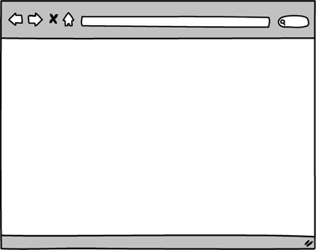
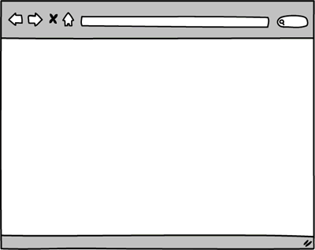
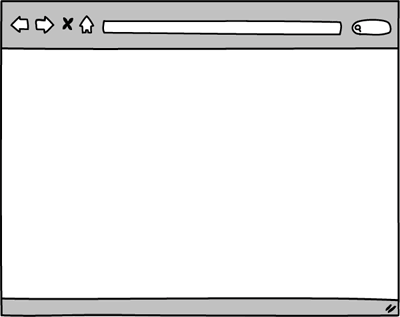
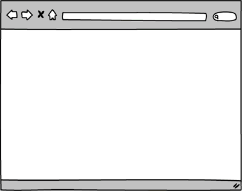

# Part 3: Build a CRUD App

## Summary

In Part 3 of the assessment, you'll build a web-stack application:  controllers, views, user authentication, database migrations, model validations, associations, etc.  This is an opportunity to demonstrate your proficiency in the core skills from Phase 2.

### Completing Part 3
Part 3 is the final part of the Phase 2 assessment.  If Parts 1 and 2 are finished, devote the rest of the day to completing as much of this application as possible.  The time allocated for the assessment might end before you've finished all the releases. If time is running out, continue to complete the releases in order and make as much progress as you can.  Use your time wisely:  if you're stuck,  ask questions and get help.

### Web Application Overview
You'll be building a site to organize [potluck dinners][].  Users will be able to host and attend dinners.  You'll build the site one feature at a time. The requirements for each feature are described in more detail in the *Releases* section. 

## Releases
The releases describe features to build out in your web application.  Each release will describe what to build, not how to build it.  Apply best practices.  For example, the releases contain mockups of the application.  In the mockups, the URLs are omitted from the browser's address bar.  You should determine the appropriate path for each page based on the conventions / patterns you've learned in Phase 2.

### Pre-release: Setup
Make sure that everything is set up before we begin working on the application: install any necessary gems and create the database.  From the command line, navigate to the `part-3` directory of the Phase 2 assessment.  Once there, run ...

0. `$ bundle`
0. `$ bundle exec rake db:create`

### Release 0: User Registration
The first feature to build is user registration, which allows users to create new accounts.  What are best practices for user registration?  What routes do you need?  How can you keep user data safe?

On the homepage, add a "register" link.  Clicking the link takes the user to a page with a form for creating a new account.  Users must register with an e-mail address, a username, and a password.  The e-mail address and username must be unique.

If registration is unsuccessful, the user should see the registration form and the associated error messages.  If registration is successful, the user should be considered logged in and redirected to the homepage where the "register" link is replaced with the user's username.  This is demonstrated in Figure 1.

  
*Figure 1*. Registering unsuccessfully and then successfully.

### Release 1: Login/Logout
Now that users can register, allow them to login and logout.  On the homepage, add a "login" link next to the "register" link.  Clicking the link takes the user to a page with a form for logging in.  Users sign in with an e-mail address and password.

If login is unsuccessful, the user should see the login form and an error message.  If login is successful, the user should be considered logged in and redirected to the homepage where the "login" and "register" links are replaced with the user's username and a "logout" link.

Clicking the "logout" link logs the user out and redirects the user back to the homepage.  These behaviors are demonstrated in Figure 2.

  
*Figure 2*. Logging in unsuccessfully, logging in successfully, and logging out.

### Release 2: Hosting Potlucks
Add a feature that allows registered users to host potlucks. Logged-in users should see a "host a potluck" link on the homepage. Clicking the link takes the user to a form. The form should collect data like the date, time, and location of the potluck.

When the form is submitted, if adding the potluck is unsuccessful (e.g., failing a validation), the user should see the form and the associated error messages. If adding the potluck is successful, the user should be redirected to a page showing the potluck's details. Each potluck should be associated with the user who added it. This is demonstrated in Figure 3.

*Note:*  The time a potluck starts should be saved in a datetime field. If you use a text input in your form, users should enter the date in the following format: YYYY-MM-DD HH:MM (e.g., 2017-05-22 12:00).

  
*Figure 3*.  Adding a potluck unsuccessfully and then successfully.

### Release 3:  Browsing Potlucks
Add a feature that lists potlucks.  Potlucks should be listed on the homepage for any visitor to browse.  Only list potlucks that have not started.  Order the potlucks by starting time.  The potluck with the nearest starting time should be at the top of the list.  Each potluck's name, location, and start time should be displayed. The name should be a link. Clicking the link takes the user to a page showing the potluck's details. This is demonstrated in Figure 4.

  
*Figure 4*.  Browsing potlucks and viewing a specific potluck.

### Release 4: Editing a Potluck's Details
Allow users to edit potluck details. On the page showing a potluck, if a logged-in user is also the potluck's host, the user should see an "edit" link. Clicking the link takes the user to a form for editing the potluck. The form should be populated with the potluck's current details. Submitting the form makes a request to update the potluck.

If the update is unsuccessful, the user should see the form and the associated error messages. If updating the potluck is successful, the user should be redirected to a page showing the potluck's details. The successful outcome is demonstrated in Figure 5.

  
*Figure 5.*  Logging in and successfully editing a potluck.

### Release 5: Deleting a Potluck
In the same way that users might need to edit a potluck, they might also need to delete a potluck. Add a feature that allows users to delete potlucks which they've previously added.

On the page showing a potluck, add a "delete" button next to the "edit" link for any potlucks the user added. Clicking the button should delete the potluck and redirect the user back to the homepage. This is demonstrated in Figure 6.

*Note:* The "delete" button is part of a form used to submit a RESTful request to delete an item. In Figure 6, it is styled to look like a link.

  
*Figure 6*.  Logging in and deleting a potluck.

### Release 6: Apply Responsible Behavior Per User and Route
Refine what you've done so far. In particular, think about how we can provide a good, secure application for users. Use your best judgement to make any appropriate code changes. Be prepared to explain why your choices were appropriate.

Consider:

- Who can access the form to add a potluck?
- Who can access the form to edit a specific potluck?
- Who can edit a specific potluck?
- Who can delete a specific potluck?

### Release 7: Attending Potlucks
Add a feature that allows logged-in users to attend potlucks.  Don't worry about who's allowed to attend: any registered user can attend any potluck.

Update the page showing a potluck to display a list of the attendees and what food they will bring to share.  Also, if a user is logged in but not the host, then display a form that allows users to sign up to attend a potluck.  When a user signs up, the user must specify a food to bring, and the same food cannot be brought to the same potluck by multiple users (i.e., two users cannot sign up to bring Jell-O to the same potluck).

When submitting the form, if the attendance is unsuccessfully created, the user should see the potluck page with the form and the associated error messages.  If the attendance is successfully created, the user should be redirected to the potluck's show page. Instead of seeing a form for signing up to attend, the user should be reminded what food they have committed to bring.  Signing up to attend a potluck is demonstrated in Figure 7.

  
*Figure 7*.  Logging in and signing up to attend a potluck.

## Conclusion

Part-3 wraps up the assessment.  If you haven't already done so, commit your changes.  Please wait until the end of the assessment period to submit your solution.

[potluck dinners]: https://en.wikipedia.org/wiki/Potluck
